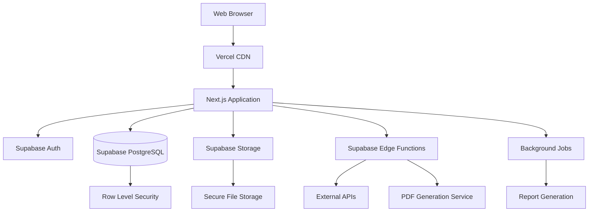
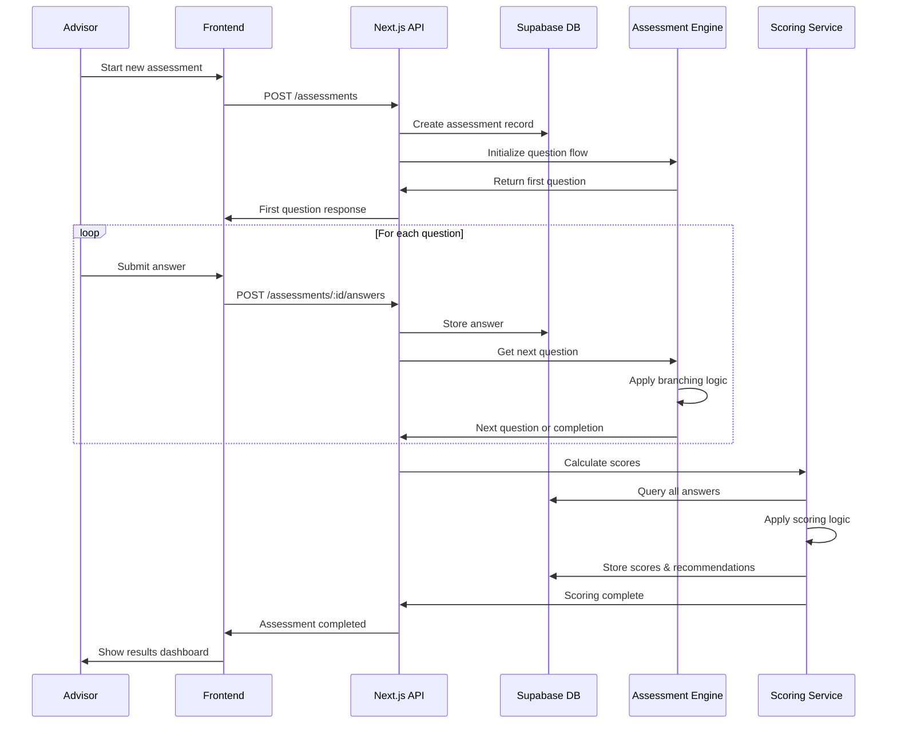
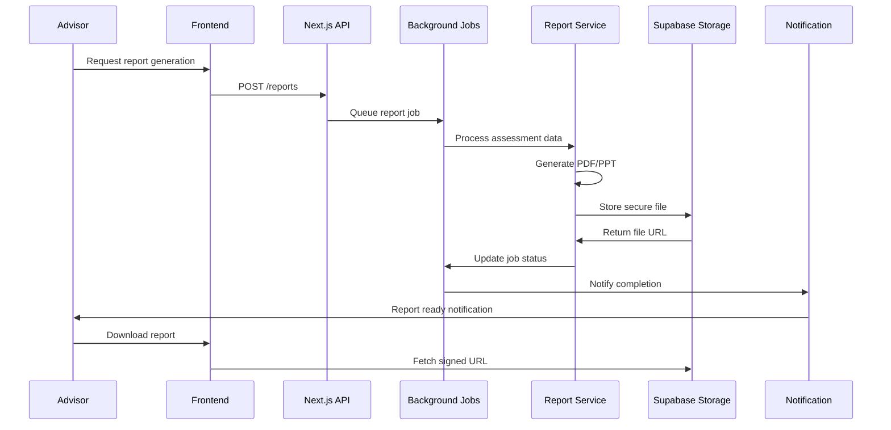
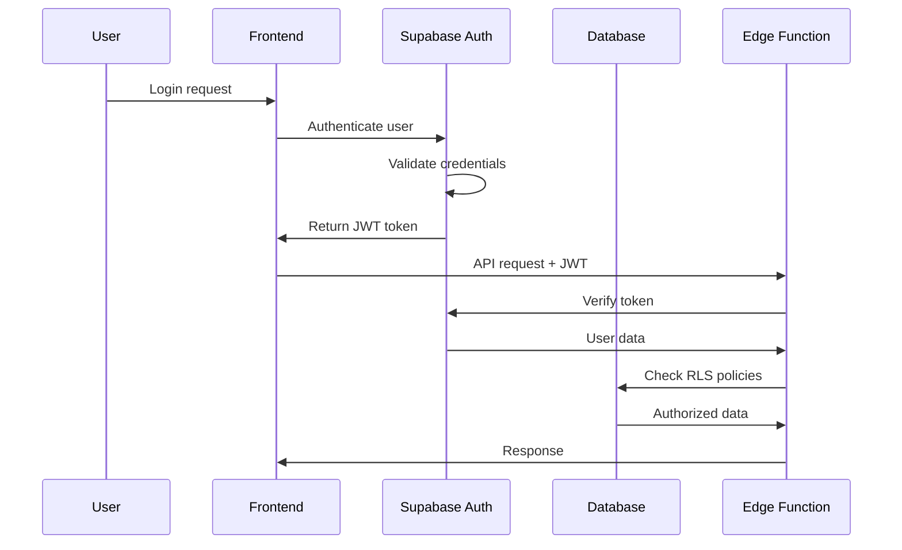
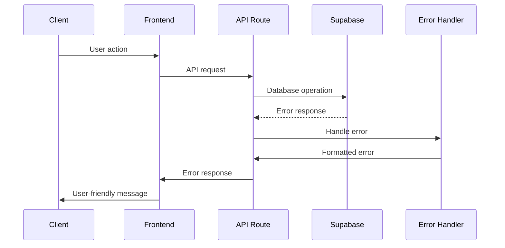

# CISPA Fullstack Architecture Document

## Introduction

This document outlines the complete fullstack architecture for **CISPA (CIS Platform Assessment)**, including backend systems, frontend implementation, and their integration. It serves as the single source of truth for AI-driven development, ensuring consistency across the entire technology stack.

This unified approach combines what would traditionally be separate backend and frontend architecture documents, streamlining the development process for modern fullstack applications where these concerns are increasingly intertwined.

### Starter Template Decision

**Decision:** Supabase + Next.js Fullstack Starter

Based on comprehensive trade-off analysis, CISPA will utilize **Supabase + Next.js** as the foundational stack. This choice provides:
- Built-in compliance features for SOC 2/ISO 27001 path
- Real-time capabilities for dynamic assessment workflows  
- Rapid MVP development for faster time-to-market
- Integrated authentication and secure file storage
- Scalable foundation with migration path to enterprise solutions

### Change Log

| Date | Version | Description | Author |
|------|---------|-------------|---------|
| 2025-01-05 | 1.0 | Initial architecture document creation | John (PM Agent) |

---

## High Level Architecture

### Technical Summary

CISPA employs a modern Jamstack architecture built on Next.js 14 with App Router and Supabase as the backend-as-a-service platform. The frontend delivers server-side rendered assessment workflows with client-side interactivity for dynamic scoring and real-time progress tracking. The backend leverages Supabase's PostgreSQL database with Row Level Security for enterprise-grade data protection, Edge Functions for custom business logic, and integrated file storage for secure report delivery. This architecture achieves the PRD's 95% time reduction goal through automated assessment workflows, async report generation, and real-time investor matching capabilities, while maintaining enterprise security standards required for financial services compliance.

### Platform and Infrastructure Choice

**Platform:** Supabase + Vercel  
**Key Services:** Supabase (Database, Auth, Storage, Edge Functions), Vercel (Frontend Hosting, Serverless Functions), Resend (Email), Stripe (Payments)  
**Deployment Host and Regions:** Vercel Global CDN with primary regions in US-East (Virginia) and US-West (Oregon), Supabase US-East database

### Repository Structure

**Structure:** Monorepo with Next.js App Router  
**Monorepo Tool:** Turborepo  
**Package Organization:** Apps (web, docs), packages (ui, shared, config)

### High Level Architecture Diagram



### Architectural Patterns

- **Jamstack Architecture:** Static site generation with serverless APIs - _Rationale:_ Optimal performance and scalability for assessment workflows
- **Component-Based UI:** Reusable React components with TypeScript - _Rationale:_ Maintainability and type safety across assessment interfaces  
- **Repository Pattern:** Abstract data access logic through Supabase client - _Rationale:_ Enables testing and future database migration flexibility
- **Edge Function Pattern:** Serverless functions for custom business logic - _Rationale:_ Scalable processing without infrastructure management
- **Real-time Subscription Pattern:** Live updates for assessment progress - _Rationale:_ Enhanced user experience during assessment completion

---

## Tech Stack

| Category | Technology | Version | Purpose | Rationale |
|----------|------------|---------|---------|-----------|
| Frontend Language | TypeScript | 5.3+ | Type-safe development | Eliminates runtime errors, improves maintainability |
| Frontend Framework | Next.js | 14.x | Full-stack React framework | App Router, SSR/SSG, API routes, optimal performance |
| UI Component Library | Shadcn/UI | Latest | Pre-built accessible components | Rapid development with consistent design system |
| State Management | Zustand | 4.x | Client state management | Lightweight, TypeScript-friendly, less boilerplate than Redux |
| Backend Language | TypeScript | 5.3+ | Serverless functions | Consistent language across stack |
| Backend Framework | Supabase Edge Functions | Latest | Serverless backend logic | Integrated with database, auto-scaling |
| API Style | REST + Real-time | Supabase Client | Database operations + subscriptions | Built-in real-time, automatic API generation |
| Database | PostgreSQL | 15+ | Primary data store | ACID compliance, complex queries, JSON support |
| Cache | Supabase Caching | Built-in | Query result caching | Automatic optimization, no configuration needed |
| File Storage | Supabase Storage | Latest | Secure file handling | Integrated auth, CDN delivery, policy-based access |
| Authentication | Supabase Auth | Latest | User management & security | Built-in providers, JWT tokens, RLS integration |
| Frontend Testing | Vitest + Testing Library | Latest | Unit/integration testing | Fast execution, React component testing |
| Backend Testing | Vitest | Latest | Database/function testing | Consistent testing framework |
| E2E Testing | Playwright | Latest | End-to-end automation | Cross-browser, reliable, fast execution |
| Build Tool | Turborepo | Latest | Monorepo build orchestration | Incremental builds, caching, parallel execution |
| Bundler | Webpack (Next.js) | Built-in | Module bundling | Optimized for Next.js, automatic optimizations |
| IaC Tool | Terraform | 1.6+ | Infrastructure as code | Repeatable deployments, state management |
| CI/CD | GitHub Actions | Latest | Automated deployment | Integrated with GitHub, extensive ecosystem |
| Monitoring | Vercel Analytics + Supabase | Built-in | Performance & error tracking | Zero-config monitoring, real user metrics |
| Logging | Supabase Logging | Built-in | Application & database logs | Centralized logging, query performance insights |
| CSS Framework | Tailwind CSS | 3.x | Utility-first styling | Rapid styling, consistent design system |

---

## Data Models

### Assessment

**Purpose:** Core entity representing a complete CISPA assessment instance with scoring and recommendations

**Key Attributes:**
- id: UUID - Unique assessment identifier
- company_name: string - Client company name
- advisor_id: UUID - Foreign key to advisor user
- founder_id: UUID - Optional foreign key to founder user  
- status: enum - Assessment state (in_progress, completed, archived)
- started_at: timestamp - Assessment initialization time
- completed_at: timestamp - Assessment completion time
- overall_readiness_score: number - Calculated readiness percentage
- dimension_scores: JSON - Scores for 6 core dimensions
- recommendations: JSON - Prioritized improvement recommendations

#### TypeScript Interface
```typescript
interface Assessment {
  id: string;
  company_name: string;
  advisor_id: string;
  founder_id?: string;
  status: 'in_progress' | 'completed' | 'archived';
  started_at: string;
  completed_at?: string;
  overall_readiness_score?: number;
  dimension_scores?: Record<string, number>;
  recommendations?: Recommendation[];
  created_at: string;
  updated_at: string;
}
```

#### Relationships
- Belongs to advisor (User)
- Optionally belongs to founder (User)
- Has many answers (Answer)
- Has many reports (Report)
- Has many investor shortlists (InvestorShortlist)

### User

**Purpose:** Unified user model supporting advisors, founders, and admin roles with role-based permissions

**Key Attributes:**
- id: UUID - Unique user identifier
- email: string - Primary authentication email
- role: enum - User type (advisor, founder, admin)
- company_name: string - Associated company (for founders)
- profile_data: JSON - Role-specific profile information
- subscription_tier: enum - Feature access level

#### TypeScript Interface
```typescript
interface User {
  id: string;
  email: string;
  role: 'advisor' | 'founder' | 'admin';
  company_name?: string;
  profile_data: Record<string, any>;
  subscription_tier: 'free' | 'pro' | 'enterprise';
  created_at: string;
  updated_at: string;
}
```

#### Relationships
- Has many assessments (as advisor or founder)
- Has many reports (Report)
- Has many share links (Share)

### Question

**Purpose:** Assessment question library with branching logic and scoring weights

**Key Attributes:**
- id: UUID - Unique question identifier
- question_text: string - Question content
- question_type: enum - Input type (text, number, multiple_choice, file_upload)
- dimension: string - One of 6 core dimensions
- module: enum - Assessment module (core, marketing, technology, investor)
- weight: number - Scoring impact multiplier
- branching_conditions: JSON - Conditional display logic

#### TypeScript Interface
```typescript
interface Question {
  id: string;
  question_text: string;
  question_type: 'text' | 'number' | 'multiple_choice' | 'file_upload';
  dimension: string;
  module: 'core' | 'marketing' | 'technology' | 'investor';
  weight: number;
  branching_conditions?: Record<string, any>;
  created_at: string;
  updated_at: string;
}
```

#### Relationships
- Has many answers (Answer)

### Answer

**Purpose:** User responses to assessment questions with metadata and audit trail

**Key Attributes:**
- id: UUID - Unique answer identifier
- assessment_id: UUID - Foreign key to assessment
- question_id: UUID - Foreign key to question
- answer_value: string - User response data
- answer_metadata: JSON - Additional context (file paths, etc.)
- created_by: UUID - User who provided answer

#### TypeScript Interface
```typescript
interface Answer {
  id: string;
  assessment_id: string;
  question_id: string;
  answer_value: string;
  answer_metadata?: Record<string, any>;
  created_by: string;
  created_at: string;
  updated_at: string;
}
```

#### Relationships
- Belongs to assessment (Assessment)
- Belongs to question (Question)
- Belongs to user (User via created_by)

### Report

**Purpose:** Generated deliverables from completed assessments with version control

**Key Attributes:**
- id: UUID - Unique report identifier
- assessment_id: UUID - Foreign key to assessment
- report_type: enum - Format type (pdf, powerpoint)
- file_path: string - Storage location
- generated_by: UUID - User who generated report
- report_data: JSON - Report configuration and metadata

#### TypeScript Interface
```typescript
interface Report {
  id: string;
  assessment_id: string;
  report_type: 'pdf' | 'powerpoint';
  file_path: string;
  generated_by: string;
  report_data: Record<string, any>;
  created_at: string;
  updated_at: string;
}
```

#### Relationships
- Belongs to assessment (Assessment)
- Belongs to user (User via generated_by)
- Has many shares (Share)

---

## API Specification

### REST API Specification

```yaml
openapi: 3.0.0
info:
  title: CISPA API
  version: 1.0.0
  description: CIS Platform Assessment REST API
servers:
  - url: https://api.cispa.com/v1
    description: Production API
  - url: https://staging-api.cispa.com/v1  
    description: Staging API

paths:
  /assessments:
    post:
      summary: Create new assessment
      security:
        - BearerAuth: []
      requestBody:
        content:
          application/json:
            schema:
              type: object
              properties:
                company_name:
                  type: string
                modules:
                  type: array
                  items:
                    type: string
      responses:
        201:
          description: Assessment created
          content:
            application/json:
              schema:
                $ref: '#/components/schemas/Assessment'
    get:
      summary: List user's assessments
      security:
        - BearerAuth: []
      responses:
        200:
          description: Assessment list
          content:
            application/json:
              schema:
                type: array
                items:
                  $ref: '#/components/schemas/Assessment'

  /assessments/{id}/questions:
    get:
      summary: Get next question for assessment
      parameters:
        - name: id
          in: path
          required: true
          schema:
            type: string
      security:
        - BearerAuth: []
      responses:
        200:
          description: Next question
          content:
            application/json:
              schema:
                $ref: '#/components/schemas/Question'

  /assessments/{id}/answers:
    post:
      summary: Submit answer to question
      parameters:
        - name: id
          in: path
          required: true
          schema:
            type: string
      security:
        - BearerAuth: []
      requestBody:
        content:
          application/json:
            schema:
              type: object
              properties:
                question_id:
                  type: string
                answer_value:
                  type: string
      responses:
        201:
          description: Answer submitted
          content:
            application/json:
              schema:
                $ref: '#/components/schemas/Answer'

  /reports:
    post:
      summary: Generate report from assessment
      security:
        - BearerAuth: []
      requestBody:
        content:
          application/json:
            schema:
              type: object
              properties:
                assessment_id:
                  type: string
                report_type:
                  type: string
                  enum: [pdf, powerpoint]
      responses:
        202:
          description: Report generation started
          content:
            application/json:
              schema:
                type: object
                properties:
                  job_id:
                    type: string
                  status:
                    type: string

components:
  schemas:
    Assessment:
      type: object
      properties:
        id:
          type: string
        company_name:
          type: string
        status:
          type: string
          enum: [in_progress, completed, archived]
        overall_readiness_score:
          type: number
    
    Question:
      type: object
      properties:
        id:
          type: string
        question_text:
          type: string
        question_type:
          type: string
          enum: [text, number, multiple_choice, file_upload]
    
    Answer:
      type: object
      properties:
        id:
          type: string
        question_id:
          type: string
        answer_value:
          type: string

  securitySchemes:
    BearerAuth:
      type: http
      scheme: bearer
      bearerFormat: JWT
```

---

## Components

### Assessment Engine

**Responsibility:** Manages dynamic question flow, conditional branching, and progress tracking for CISPA assessments

**Key Interfaces:**
- `startAssessment(companyName, modules)` - Initialize new assessment
- `getNextQuestion(assessmentId)` - Retrieve next question based on responses
- `submitAnswer(assessmentId, questionId, answer)` - Process and store answer
- `calculateScore(assessmentId)` - Generate readiness scores and recommendations

**Dependencies:** Question service, Scoring service, Database layer

**Technology Stack:** Next.js API routes, Supabase real-time subscriptions, TypeScript validation

### Scoring and Recommendations Engine  

**Responsibility:** Calculates readiness scores across 6 dimensions and generates prioritized improvement recommendations

**Key Interfaces:**
- `calculateDimensionScores(answers)` - Compute individual dimension scores
- `generateOverallScore(dimensionScores)` - Aggregate total readiness score
- `generateRecommendations(scores, answers)` - Create prioritized improvement list
- `benchmarkAgainstIndustry(scores)` - Compare to anonymized industry data

**Dependencies:** Assessment data, Industry benchmarks, Business rules engine

**Technology Stack:** Supabase Edge Functions, PostgreSQL stored procedures, JSON processing

### Report Generation Service

**Responsibility:** Creates professional PDF and PowerPoint deliverables from completed assessments

**Key Interfaces:**
- `generateReport(assessmentId, reportType, branding)` - Create formatted report
- `renderVisualizations(scoreData)` - Generate charts and radar diagrams
- `applyBranding(report, advisorBranding)` - Customize report appearance
- `storeSecurely(report)` - Save to encrypted storage

**Dependencies:** Assessment data, Template engine, File storage, PDF/PPT libraries

**Technology Stack:** Puppeteer (PDF), PptxGenJS (PowerPoint), Supabase Storage, Background jobs

### Investor Matching Service

**Responsibility:** Matches company profiles with investor criteria to generate strategic shortlists

**Key Interfaces:**
- `generateShortlist(assessmentId, criteria)` - Create filtered investor list
- `rankInvestors(shortlist, weights)` - Apply custom weighting criteria  
- `compareInvestors(investorIds)` - Side-by-side comparison matrix
- `updateInvestorDatabase(investorData)` - Maintain investor profiles

**Dependencies:** Investor database, Assessment scores, Matching algorithms

**Technology Stack:** PostgreSQL full-text search, Supabase Edge Functions, Vector similarity

### Authentication and Authorization Service

**Responsibility:** Manages user authentication, role-based access control, and security policies

**Key Interfaces:**
- `authenticateUser(credentials)` - Validate user identity
- `authorizeAccess(userId, resource)` - Check permission levels
- `manageSession(token)` - Handle JWT token lifecycle
- `auditAccess(userId, action)` - Log security events

**Dependencies:** Supabase Auth, Row Level Security policies, Audit logging

**Technology Stack:** Supabase Auth, JWT tokens, PostgreSQL RLS, Security middleware

---

## Core Workflows

### Assessment Completion Workflow



### Report Generation Workflow



---

## Database Schema

```sql
-- Users table with role-based access
CREATE TABLE users (
  id UUID DEFAULT gen_random_uuid() PRIMARY KEY,
  email TEXT UNIQUE NOT NULL,
  role TEXT NOT NULL CHECK (role IN ('advisor', 'founder', 'admin')),
  company_name TEXT,
  profile_data JSONB DEFAULT '{}',
  subscription_tier TEXT DEFAULT 'free' CHECK (subscription_tier IN ('free', 'pro', 'enterprise')),
  created_at TIMESTAMP WITH TIME ZONE DEFAULT NOW(),
  updated_at TIMESTAMP WITH TIME ZONE DEFAULT NOW()
);

-- Assessments with comprehensive tracking
CREATE TABLE assessments (
  id UUID DEFAULT gen_random_uuid() PRIMARY KEY,
  company_name TEXT NOT NULL,
  advisor_id UUID REFERENCES users(id) NOT NULL,
  founder_id UUID REFERENCES users(id),
  status TEXT DEFAULT 'in_progress' CHECK (status IN ('in_progress', 'completed', 'archived')),
  started_at TIMESTAMP WITH TIME ZONE DEFAULT NOW(),
  completed_at TIMESTAMP WITH TIME ZONE,
  overall_readiness_score NUMERIC(5,2),
  dimension_scores JSONB DEFAULT '{}',
  recommendations JSONB DEFAULT '[]',
  created_at TIMESTAMP WITH TIME ZONE DEFAULT NOW(),
  updated_at TIMESTAMP WITH TIME ZONE DEFAULT NOW()
);

-- Questions with dynamic branching
CREATE TABLE questions (
  id UUID DEFAULT gen_random_uuid() PRIMARY KEY,
  question_text TEXT NOT NULL,
  question_type TEXT NOT NULL CHECK (question_type IN ('text', 'number', 'multiple_choice', 'file_upload')),
  dimension TEXT NOT NULL,
  module TEXT DEFAULT 'core' CHECK (module IN ('core', 'marketing', 'technology', 'investor')),
  weight NUMERIC(3,2) DEFAULT 1.0,
  branching_conditions JSONB DEFAULT '{}',
  created_at TIMESTAMP WITH TIME ZONE DEFAULT NOW(),
  updated_at TIMESTAMP WITH TIME ZONE DEFAULT NOW()
);

-- Answers with full audit trail
CREATE TABLE answers (
  id UUID DEFAULT gen_random_uuid() PRIMARY KEY,
  assessment_id UUID REFERENCES assessments(id) ON DELETE CASCADE NOT NULL,
  question_id UUID REFERENCES questions(id) NOT NULL,
  answer_value TEXT NOT NULL,
  answer_metadata JSONB DEFAULT '{}',
  created_by UUID REFERENCES users(id) NOT NULL,
  created_at TIMESTAMP WITH TIME ZONE DEFAULT NOW(),
  updated_at TIMESTAMP WITH TIME ZONE DEFAULT NOW(),
  UNIQUE(assessment_id, question_id)
);

-- Reports with version tracking
CREATE TABLE reports (
  id UUID DEFAULT gen_random_uuid() PRIMARY KEY,
  assessment_id UUID REFERENCES assessments(id) ON DELETE CASCADE NOT NULL,
  report_type TEXT NOT NULL CHECK (report_type IN ('pdf', 'powerpoint')),
  file_path TEXT NOT NULL,
  generated_by UUID REFERENCES users(id) NOT NULL,
  report_data JSONB DEFAULT '{}',
  created_at TIMESTAMP WITH TIME ZONE DEFAULT NOW(),
  updated_at TIMESTAMP WITH TIME ZONE DEFAULT NOW()
);

-- Secure sharing with expiration
CREATE TABLE shares (
  id UUID DEFAULT gen_random_uuid() PRIMARY KEY,
  report_id UUID REFERENCES reports(id) ON DELETE CASCADE NOT NULL,
  shared_by UUID REFERENCES users(id) NOT NULL,
  share_token TEXT UNIQUE NOT NULL DEFAULT encode(gen_random_bytes(32), 'base64'),
  permissions TEXT DEFAULT 'view' CHECK (permissions IN ('view', 'download')),
  expiration_date TIMESTAMP WITH TIME ZONE,
  email_restrictions JSONB DEFAULT '[]',
  access_count INTEGER DEFAULT 0,
  last_accessed_at TIMESTAMP WITH TIME ZONE,
  created_at TIMESTAMP WITH TIME ZONE DEFAULT NOW(),
  revoked_at TIMESTAMP WITH TIME ZONE
);

-- Investor database for matching
CREATE TABLE investors (
  id UUID DEFAULT gen_random_uuid() PRIMARY KEY,
  fund_name TEXT NOT NULL,
  investment_focus JSONB DEFAULT '{}', -- sectors, stages, etc.
  check_size_min NUMERIC(12,2),
  check_size_max NUMERIC(12,2),
  geographic_focus JSONB DEFAULT '[]',
  contact_info JSONB DEFAULT '{}',
  created_at TIMESTAMP WITH TIME ZONE DEFAULT NOW(),
  updated_at TIMESTAMP WITH TIME ZONE DEFAULT NOW()
);

-- Background job tracking
CREATE TABLE jobs (
  id UUID DEFAULT gen_random_uuid() PRIMARY KEY,
  job_type TEXT NOT NULL,
  status TEXT DEFAULT 'queued' CHECK (status IN ('queued', 'processing', 'completed', 'failed')),
  input_data JSONB DEFAULT '{}',
  output_data JSONB DEFAULT '{}',
  error_message TEXT,
  created_at TIMESTAMP WITH TIME ZONE DEFAULT NOW(),
  updated_at TIMESTAMP WITH TIME ZONE DEFAULT NOW(),
  completed_at TIMESTAMP WITH TIME ZONE
);

-- Indexes for performance
CREATE INDEX idx_assessments_advisor_id ON assessments(advisor_id);
CREATE INDEX idx_assessments_status ON assessments(status);
CREATE INDEX idx_answers_assessment_id ON answers(assessment_id);
CREATE INDEX idx_reports_assessment_id ON reports(assessment_id);
CREATE INDEX idx_shares_token ON shares(share_token) WHERE revoked_at IS NULL;
CREATE INDEX idx_jobs_status ON jobs(status);

-- Row Level Security policies
ALTER TABLE assessments ENABLE ROW LEVEL SECURITY;
ALTER TABLE answers ENABLE ROW LEVEL SECURITY;
ALTER TABLE reports ENABLE ROW LEVEL SECURITY;
ALTER TABLE shares ENABLE ROW LEVEL SECURITY;

-- Advisors can access their own assessments
CREATE POLICY "Advisors can access own assessments" ON assessments
  FOR ALL USING (advisor_id = auth.uid());

-- Founders can access assessments they're associated with
CREATE POLICY "Founders can access assigned assessments" ON assessments
  FOR SELECT USING (founder_id = auth.uid());
```

---

## Frontend Architecture

### Component Architecture

#### Component Organization
```
src/
├── components/
│   ├── ui/                    # Shadcn/UI base components
│   ├── assessment/            # Assessment-specific components
│   │   ├── QuestionCard.tsx
│   │   ├── ProgressTracker.tsx
│   │   └── ScoreDisplay.tsx
│   ├── reports/               # Report generation components
│   │   ├── ReportPreview.tsx
│   │   └── ShareDialog.tsx
│   ├── charts/                # Visualization components
│   │   ├── RadarChart.tsx
│   │   └── HeatMap.tsx
│   └── layout/                # Layout components
│       ├── Header.tsx
│       ├── Navigation.tsx
│       └── Footer.tsx
├── app/                       # Next.js 14 App Router
│   ├── (dashboard)/           # Protected routes
│   ├── assessment/            # Assessment flows
│   ├── reports/               # Report management
│   └── api/                   # API routes
```

#### Component Template
```typescript
// Standard component structure for CISPA
import { useState, useEffect } from 'react';
import { cn } from '@/lib/utils';

interface ComponentProps {
  className?: string;
  // Specific props
}

export function ComponentName({ className, ...props }: ComponentProps) {
  // State management
  const [state, setState] = useState();
  
  // Effects
  useEffect(() => {
    // Side effects
  }, []);
  
  return (
    <div className={cn("default-styles", className)}>
      {/* Component JSX */}
    </div>
  );
}
```

### State Management Architecture

#### State Structure
```typescript
// Global state structure using Zustand
interface AppState {
  // Authentication state
  user: User | null;
  session: Session | null;
  
  // Assessment state
  currentAssessment: Assessment | null;
  assessmentProgress: {
    currentQuestionIndex: number;
    totalQuestions: number;
    timeSpent: number;
  };
  
  // UI state
  sidebarOpen: boolean;
  theme: 'light' | 'dark';
  
  // Actions
  setUser: (user: User | null) => void;
  updateAssessmentProgress: (progress: Partial<AssessmentProgress>) => void;
  toggleSidebar: () => void;
}
```

#### State Management Patterns
- Server state managed by TanStack Query with Supabase integration
- Client state managed by Zustand for UI and temporary data
- Form state handled by React Hook Form with Zod validation
- Real-time updates via Supabase subscriptions

### Routing Architecture

#### Route Organization
```
app/
├── page.tsx                   # Landing page
├── login/                     # Authentication
├── (dashboard)/               # Protected dashboard routes
│   ├── layout.tsx            # Dashboard layout
│   ├── page.tsx              # Dashboard home
│   ├── assessments/          # Assessment management
│   │   ├── page.tsx          # Assessment list
│   │   ├── [id]/             # Individual assessment
│   │   └── new/              # Create assessment
│   ├── reports/              # Report management
│   └── settings/             # User settings
├── assessment/               # Assessment flow
│   └── [id]/                 # Assessment pages
└── shared/                   # Public shared content
    └── [token]/              # Shared report access
```

#### Protected Route Pattern
```typescript
// Middleware for protected routes
import { createMiddlewareClient } from '@supabase/auth-helpers-nextjs';
import { NextResponse } from 'next/server';

export async function middleware(req) {
  const res = NextResponse.next();
  const supabase = createMiddlewareClient({ req, res });
  
  const { data: { session } } = await supabase.auth.getSession();
  
  if (!session && req.nextUrl.pathname.startsWith('/dashboard')) {
    return NextResponse.redirect(new URL('/login', req.url));
  }
  
  return res;
}

export const config = {
  matcher: ['/dashboard/:path*', '/assessment/:path*']
};
```

### Frontend Services Layer

#### API Client Setup
```typescript
// Supabase client configuration
import { createClientComponentClient } from '@supabase/auth-helpers-nextjs';
import { Database } from '@/lib/database.types';

export const supabase = createClientComponentClient<Database>();

// API client wrapper
export class ApiClient {
  constructor(private supabase = supabase) {}
  
  async createAssessment(data: CreateAssessmentData) {
    const { data: assessment, error } = await this.supabase
      .from('assessments')
      .insert(data)
      .select()
      .single();
      
    if (error) throw new Error(error.message);
    return assessment;
  }
  
  async getAssessments() {
    const { data, error } = await this.supabase
      .from('assessments')
      .select('*')
      .order('created_at', { ascending: false });
      
    if (error) throw new Error(error.message);
    return data;
  }
}
```

#### Service Example
```typescript
// Assessment service with real-time capabilities
export class AssessmentService {
  constructor(private apiClient = new ApiClient()) {}
  
  async startAssessment(companyName: string, modules: string[]) {
    return await this.apiClient.createAssessment({
      company_name: companyName,
      status: 'in_progress',
      // Additional data
    });
  }
  
  subscribeToProgress(assessmentId: string, callback: (progress: any) => void) {
    return supabase
      .channel(`assessment:${assessmentId}`)
      .on('postgres_changes', {
        event: 'UPDATE',
        schema: 'public',
        table: 'assessments',
        filter: `id=eq.${assessmentId}`
      }, callback)
      .subscribe();
  }
}
```

---

## Backend Architecture

### Service Architecture

#### Function Organization
```
supabase/functions/
├── assessment-engine/         # Core assessment logic
│   ├── index.ts              # Main function entry
│   ├── scoring.ts            # Scoring algorithms
│   └── recommendations.ts    # Recommendation engine
├── report-generator/          # Report creation
│   ├── index.ts              # Job processor
│   ├── pdf-generator.ts      # PDF creation
│   └── ppt-generator.ts      # PowerPoint creation
├── investor-matching/         # Matching algorithms
│   ├── index.ts              # Matching logic
│   └── ranking.ts            # Ranking algorithms
└── shared/                    # Shared utilities
    ├── database.ts           # DB helpers
    ├── auth.ts               # Auth utilities
    └── types.ts              # Shared types
```

#### Function Template
```typescript
// Standard Supabase Edge Function structure
import { serve } from 'https://deno.land/std@0.168.0/http/server.ts';
import { createClient } from 'https://esm.sh/@supabase/supabase-js@2';

interface RequestData {
  // Request interface
}

interface ResponseData {
  // Response interface
}

serve(async (req: Request): Promise<Response> => {
  try {
    // CORS headers
    if (req.method === 'OPTIONS') {
      return new Response('ok', { headers: corsHeaders });
    }
    
    // Authentication check
    const authHeader = req.headers.get('Authorization');
    if (!authHeader) {
      throw new Error('No authorization header');
    }
    
    // Initialize Supabase client
    const supabase = createClient(
      Deno.env.get('SUPABASE_URL') ?? '',
      Deno.env.get('SUPABASE_ANON_KEY') ?? ''
    );
    
    // Verify JWT token
    const { data: { user }, error: authError } = await supabase.auth.getUser(
      authHeader.replace('Bearer ', '')
    );
    
    if (authError || !user) {
      throw new Error('Invalid token');
    }
    
    // Process request
    const requestData: RequestData = await req.json();
    const result = await processRequest(requestData, user, supabase);
    
    return new Response(JSON.stringify(result), {
      headers: { ...corsHeaders, 'Content-Type': 'application/json' }
    });
    
  } catch (error) {
    return new Response(JSON.stringify({ error: error.message }), {
      status: 400,
      headers: { ...corsHeaders, 'Content-Type': 'application/json' }
    });
  }
});

const corsHeaders = {
  'Access-Control-Allow-Origin': '*',
  'Access-Control-Allow-Headers': 'authorization, x-client-info, apikey, content-type'
};
```

### Database Architecture

#### Data Access Layer
```typescript
// Repository pattern for database access
export class AssessmentRepository {
  constructor(private supabase: SupabaseClient) {}
  
  async create(assessment: CreateAssessmentData): Promise<Assessment> {
    const { data, error } = await this.supabase
      .from('assessments')
      .insert(assessment)
      .select()
      .single();
      
    if (error) throw new DatabaseError(error.message);
    return data;
  }
  
  async findByAdvisor(advisorId: string): Promise<Assessment[]> {
    const { data, error } = await this.supabase
      .from('assessments')
      .select('*')
      .eq('advisor_id', advisorId)
      .order('created_at', { ascending: false });
      
    if (error) throw new DatabaseError(error.message);
    return data;
  }
  
  async updateScores(id: string, scores: ScoreData): Promise<void> {
    const { error } = await this.supabase
      .from('assessments')
      .update({
        overall_readiness_score: scores.overall,
        dimension_scores: scores.dimensions,
        recommendations: scores.recommendations
      })
      .eq('id', id);
      
    if (error) throw new DatabaseError(error.message);
  }
}
```

### Authentication and Authorization

#### Auth Flow


#### Middleware/Guards
```typescript
// Authentication middleware for Edge Functions
export async function authenticateUser(
  authHeader: string | null,
  supabase: SupabaseClient
): Promise<User> {
  if (!authHeader?.startsWith('Bearer ')) {
    throw new UnauthorizedError('Missing or invalid authorization header');
  }
  
  const token = authHeader.replace('Bearer ', '');
  
  const { data: { user }, error } = await supabase.auth.getUser(token);
  
  if (error || !user) {
    throw new UnauthorizedError('Invalid or expired token');
  }
  
  return user;
}

// Role-based authorization
export function requireRole(user: User, requiredRole: UserRole) {
  if (user.user_metadata?.role !== requiredRole) {
    throw new ForbiddenError(`Required role: ${requiredRole}`);
  }
}
```

---

## Unified Project Structure

```plaintext
cispa/
├── .github/                    # CI/CD workflows
│   └── workflows/
│       ├── ci.yaml
│       └── deploy.yaml
├── apps/                       # Application packages
│   └── web/                    # Next.js frontend application
│       ├── src/
│       │   ├── app/            # Next.js 14 App Router
│       │   │   ├── (dashboard)/
│       │   │   ├── assessment/
│       │   │   ├── reports/
│       │   │   └── api/
│       │   ├── components/     # React components
│       │   │   ├── ui/
│       │   │   ├── assessment/
│       │   │   ├── reports/
│       │   │   └── charts/
│       │   ├── lib/            # Utility libraries
│       │   │   ├── supabase.ts
│       │   │   ├── utils.ts
│       │   │   └── types.ts
│       │   ├── hooks/          # Custom React hooks
│       │   ├── stores/         # Zustand stores
│       │   └── styles/         # Global styles
│       ├── public/             # Static assets
│       ├── tests/              # Frontend tests
│       └── package.json
├── supabase/                   # Supabase configuration
│   ├── functions/              # Edge Functions
│   │   ├── assessment-engine/
│   │   ├── report-generator/
│   │   ├── investor-matching/
│   │   └── shared/
│   ├── migrations/             # Database migrations
│   └── config.toml
├── packages/                   # Shared packages
│   ├── shared/                 # Shared types/utilities
│   │   ├── src/
│   │   │   ├── types/          # TypeScript interfaces
│   │   │   ├── constants/      # Shared constants
│   │   │   └── utils/          # Shared utilities
│   │   └── package.json
│   ├── ui/                     # Shared UI components
│   │   ├── src/
│   │   └── package.json
│   └── config/                 # Shared configuration
│       ├── eslint/
│       ├── typescript/
│       └── tailwind/
├── infrastructure/             # Terraform IaC
│   ├── environments/
│   │   ├── staging/
│   │   └── production/
│   └── modules/
├── scripts/                    # Build/deploy scripts
├── docs/                       # Documentation
│   ├── prd.md
│   ├── architecture.md
│   └── prd/
├── .env.example                # Environment template
├── package.json                # Root package.json
├── turbo.json                  # Turborepo configuration
└── README.md
```

---

## Development Workflow

### Local Development Setup

#### Prerequisites
```bash
# Install Node.js 18+ and package manager
node --version  # Should be 18+
npm --version   # or yarn/pnpm

# Install Supabase CLI
npm install -g supabase
supabase --version

# Install Docker for local Supabase
docker --version
```

#### Initial Setup
```bash
# Clone repository
git clone https://github.com/your-org/cispa.git
cd cispa

# Install dependencies
npm install

# Setup Supabase locally
supabase init
supabase start

# Setup environment variables
cp .env.example .env.local
# Edit .env.local with your Supabase credentials

# Run database migrations
supabase db reset

# Seed initial data
npm run db:seed
```

#### Development Commands
```bash
# Start all services
npm run dev

# Start frontend only  
npm run dev:web

# Start Supabase locally
supabase start

# Run tests
npm run test        # All tests
npm run test:web    # Frontend tests only
npm run test:e2e    # End-to-end tests

# Database operations
npm run db:reset    # Reset local database
npm run db:migrate  # Apply migrations
npm run db:seed     # Seed test data
```

### Environment Configuration

#### Required Environment Variables
```bash
# Frontend (.env.local)
NEXT_PUBLIC_SUPABASE_URL=http://localhost:54321
NEXT_PUBLIC_SUPABASE_ANON_KEY=your_anon_key
NEXT_PUBLIC_APP_URL=http://localhost:3000

# Supabase (.env)
SUPABASE_URL=http://localhost:54321
SUPABASE_SERVICE_KEY=your_service_key
SUPABASE_DB_PASSWORD=your_password

# External Services
RESEND_API_KEY=your_resend_key
STRIPE_SECRET_KEY=your_stripe_key
OPENAI_API_KEY=your_openai_key

# Shared
NODE_ENV=development
APP_ENV=local
```

---

## Deployment Architecture

### Deployment Strategy

**Frontend Deployment:**
- **Platform:** Vercel
- **Build Command:** `turbo build --filter=web`
- **Output Directory:** `apps/web/.next`
- **CDN/Edge:** Vercel Edge Network with global distribution

**Backend Deployment:**
- **Platform:** Supabase Cloud
- **Build Command:** `supabase functions build`
- **Deployment Method:** GitHub integration with automatic deployments

### CI/CD Pipeline
```yaml
# .github/workflows/ci.yaml
name: CI/CD Pipeline

on:
  push:
    branches: [main, develop]
  pull_request:
    branches: [main]

jobs:
  test:
    runs-on: ubuntu-latest
    steps:
      - uses: actions/checkout@v4
      - uses: actions/setup-node@v4
        with:
          node-version: 18
          cache: npm
      
      - run: npm ci
      - run: npm run lint
      - run: npm run type-check
      - run: npm run test
      - run: npm run build
  
  deploy-staging:
    if: github.ref == 'refs/heads/develop'
    needs: test
    runs-on: ubuntu-latest
    steps:
      - uses: actions/checkout@v4
      - name: Deploy to Vercel
        uses: amondnet/vercel-action@v25
        with:
          vercel-token: ${{ secrets.VERCEL_TOKEN }}
          vercel-org-id: ${{ secrets.VERCEL_ORG_ID }}
          vercel-project-id: ${{ secrets.VERCEL_PROJECT_ID }}
  
  deploy-production:
    if: github.ref == 'refs/heads/main'
    needs: test
    runs-on: ubuntu-latest
    steps:
      - uses: actions/checkout@v4
      - name: Deploy to Production
        uses: amondnet/vercel-action@v25
        with:
          vercel-token: ${{ secrets.VERCEL_TOKEN }}
          vercel-org-id: ${{ secrets.VERCEL_ORG_ID }}
          vercel-project-id: ${{ secrets.VERCEL_PROJECT_ID }}
          vercel-args: '--prod'
```

### Environments

| Environment | Frontend URL | Backend URL | Purpose |
|-------------|-------------|-------------|---------|
| Development | http://localhost:3000 | http://localhost:54321 | Local development |
| Staging | https://staging.cispa.com | https://staging-api.cispa.com | Pre-production testing |
| Production | https://app.cispa.com | https://api.cispa.com | Live environment |

---

## Security and Performance

### Security Requirements

**Frontend Security:**
- CSP Headers: `default-src 'self'; script-src 'self' 'unsafe-eval' 'unsafe-inline'`
- XSS Prevention: Sanitization of all user inputs, Content Security Policy
- Secure Storage: JWT tokens in httpOnly cookies, sensitive data encrypted

**Backend Security:**
- Input Validation: Zod schemas for all API endpoints
- Rate Limiting: 100 requests per minute per user, 1000 per hour
- CORS Policy: Restricted to production domains only

**Authentication Security:**
- Token Storage: JWT in httpOnly cookies with SameSite=Strict
- Session Management: 24-hour expiry with refresh token rotation
- Password Policy: 12+ characters, complexity requirements

### Performance Optimization

**Frontend Performance:**
- Bundle Size Target: < 500KB gzipped for main bundle
- Loading Strategy: Lazy loading for assessment modules and reports
- Caching Strategy: SWR for API calls, static asset caching

**Backend Performance:**
- Response Time Target: < 200ms for API calls, < 5s for report generation
- Database Optimization: Proper indexing, query optimization, connection pooling
- Caching Strategy: Redis for computed scores, CDN for static assets

---

## Testing Strategy

### Testing Pyramid
```
       E2E Tests (Playwright)
      /                    \
   Integration Tests      API Tests
  /                        \
Frontend Unit Tests    Backend Unit Tests
    (Vitest + RTL)      (Vitest + Supertest)
```

### Test Organization

#### Frontend Tests
```
tests/
├── __mocks__/              # Mock configurations
├── components/             # Component tests
│   ├── assessment/
│   ├── reports/
│   └── ui/
├── hooks/                  # Custom hook tests
├── pages/                  # Page component tests
├── utils/                  # Utility function tests
└── setup.ts               # Test setup
```

#### Backend Tests
```
supabase/functions/__tests__/
├── assessment-engine/      # Edge function tests
├── report-generator/       # Report generation tests
├── investor-matching/      # Matching algorithm tests
└── shared/                 # Shared utility tests
```

#### E2E Tests
```
e2e/
├── assessment-flow.spec.ts # Complete assessment workflow
├── report-generation.spec.ts # Report creation and sharing
├── user-management.spec.ts # Authentication and authorization
└── api/                   # API integration tests
```

### Test Examples

#### Frontend Component Test
```typescript
// tests/components/assessment/QuestionCard.test.tsx
import { render, screen, fireEvent } from '@testing-library/react';
import { QuestionCard } from '@/components/assessment/QuestionCard';

const mockQuestion = {
  id: '1',
  question_text: 'What is your company revenue?',
  question_type: 'number' as const,
  dimension: 'Financial'
};

describe('QuestionCard', () => {
  it('renders question text correctly', () => {
    render(
      <QuestionCard 
        question={mockQuestion}
        onAnswer={vi.fn()}
      />
    );
    
    expect(screen.getByText('What is your company revenue?')).toBeInTheDocument();
  });
  
  it('calls onAnswer when submitting response', () => {
    const mockOnAnswer = vi.fn();
    render(
      <QuestionCard 
        question={mockQuestion}
        onAnswer={mockOnAnswer}
      />
    );
    
    const input = screen.getByRole('textbox');
    fireEvent.change(input, { target: { value: '1000000' } });
    fireEvent.click(screen.getByText('Next'));
    
    expect(mockOnAnswer).toHaveBeenCalledWith('1000000');
  });
});
```

#### Backend API Test
```typescript
// supabase/functions/__tests__/assessment-engine.test.ts
import { serve } from 'https://deno.land/std@0.168.0/http/server.ts';
import { assertEquals } from 'https://deno.land/std@0.168.0/testing/asserts.ts';

Deno.test('Assessment Engine - Calculate Scores', async () => {
  const mockAnswers = [
    { question_id: '1', answer_value: '1000000', dimension: 'Financial' },
    { question_id: '2', answer_value: 'Yes', dimension: 'Operational' }
  ];
  
  const result = await calculateAssessmentScores(mockAnswers);
  
  assertEquals(result.overall_score >= 0, true);
  assertEquals(result.overall_score <= 100, true);
  assertEquals(Object.keys(result.dimension_scores).length, 6);
  assertEquals(result.recommendations.length > 0, true);
});
```

#### E2E Test
```typescript
// e2e/assessment-flow.spec.ts
import { test, expect } from '@playwright/test';

test('Complete assessment workflow', async ({ page }) => {
  // Login as advisor
  await page.goto('/login');
  await page.fill('[data-testid=email]', 'advisor@example.com');
  await page.fill('[data-testid=password]', 'password123');
  await page.click('[data-testid=login-button]');
  
  // Start new assessment
  await page.goto('/dashboard/assessments/new');
  await page.fill('[data-testid=company-name]', 'Test Company Inc');
  await page.click('[data-testid=start-assessment]');
  
  // Answer questions
  for (let i = 0; i < 5; i++) {
    await page.waitForSelector('[data-testid=question-card]');
    await page.fill('[data-testid=answer-input]', 'Test answer');
    await page.click('[data-testid=next-question]');
  }
  
  // Complete assessment
  await page.click('[data-testid=complete-assessment]');
  await page.waitForSelector('[data-testid=results-page]');
  
  // Verify results
  await expect(page.locator('[data-testid=overall-score]')).toBeVisible();
  await expect(page.locator('[data-testid=recommendations]')).toBeVisible();
});
```

---

## Coding Standards

### Critical Fullstack Rules

- **Type Sharing:** Always define types in packages/shared and import from there
- **API Calls:** Never make direct HTTP calls - use the service layer and Supabase client
- **Environment Variables:** Access only through config objects, never process.env directly
- **Error Handling:** All API routes must use the standard error handler middleware
- **State Updates:** Never mutate state directly - use proper state management patterns
- **Database Access:** Always use RLS policies and repository pattern for data access
- **Authentication:** Verify JWT tokens in all protected routes and functions
- **File Uploads:** Use Supabase Storage with proper security policies
- **Real-time Updates:** Implement optimistic updates with Supabase subscriptions

### Naming Conventions

| Element | Frontend | Backend | Example |
|---------|----------|---------|---------|
| Components | PascalCase | - | `QuestionCard.tsx` |
| Hooks | camelCase with 'use' | - | `useAssessment.ts` |
| API Routes | - | kebab-case | `/api/assessment-engine` |
| Database Tables | - | snake_case | `assessment_answers` |
| Functions | camelCase | camelCase | `calculateScore` |
| Edge Functions | kebab-case | - | `report-generator` |
| Environment Variables | UPPER_SNAKE_CASE | UPPER_SNAKE_CASE | `SUPABASE_URL` |

---

## Error Handling Strategy

### Error Flow


### Error Response Format
```typescript
interface ApiError {
  error: {
    code: string;
    message: string;
    details?: Record<string, any>;
    timestamp: string;
    requestId: string;
  };
}
```

### Frontend Error Handling
```typescript
// Global error boundary and error handling
export function ErrorBoundary({ children }: { children: React.ReactNode }) {
  return (
    <Sentry.ErrorBoundary fallback={ErrorFallback} showDialog>
      {children}
    </Sentry.ErrorBoundary>
  );
}

// API error handling hook
export function useErrorHandler() {
  const { toast } = useToast();
  
  return useCallback((error: any) => {
    console.error('API Error:', error);
    
    // User-friendly error messages
    const message = error.message || 'An unexpected error occurred';
    
    toast({
      variant: 'destructive',
      title: 'Error',
      description: message,
    });
  }, [toast]);
}
```

### Backend Error Handling
```typescript
// Standardized error classes
export class AppError extends Error {
  constructor(
    public message: string,
    public statusCode: number = 500,
    public code: string = 'INTERNAL_ERROR'
  ) {
    super(message);
    this.name = this.constructor.name;
  }
}

export class ValidationError extends AppError {
  constructor(message: string, details?: any) {
    super(message, 400, 'VALIDATION_ERROR');
    this.details = details;
  }
}

// Global error handler for Edge Functions
export function handleError(error: Error): Response {
  const timestamp = new Date().toISOString();
  const requestId = crypto.randomUUID();
  
  console.error(`[${requestId}] Error:`, error);
  
  if (error instanceof AppError) {
    return new Response(JSON.stringify({
      error: {
        code: error.code,
        message: error.message,
        details: error.details,
        timestamp,
        requestId
      }
    }), {
      status: error.statusCode,
      headers: { 'Content-Type': 'application/json' }
    });
  }
  
  return new Response(JSON.stringify({
    error: {
      code: 'INTERNAL_ERROR',
      message: 'An internal error occurred',
      timestamp,
      requestId
    }
  }), {
    status: 500,
    headers: { 'Content-Type': 'application/json' }
  });
}
```

---

## Monitoring and Observability

### Monitoring Stack
- **Frontend Monitoring:** Vercel Analytics + Sentry
- **Backend Monitoring:** Supabase Monitoring + Edge Function Logs  
- **Error Tracking:** Sentry for client-side and server-side errors
- **Performance Monitoring:** Core Web Vitals, API response times

### Key Metrics

**Frontend Metrics:**
- Core Web Vitals (LCP, FID, CLS)
- JavaScript errors and stack traces
- API response times from client perspective
- User interaction flows and conversion rates

**Backend Metrics:**
- Request rate per endpoint
- Error rate by function and endpoint
- Response time percentiles (p50, p95, p99)
- Database query performance and slow queries

---

## Architecture Document Complete

This comprehensive architecture document provides the technical foundation for CISPA development. All major system components, data flows, and implementation patterns are defined to enable consistent AI-driven development across the entire fullstack application.

**Next Steps:**
1. Review and validate architecture decisions
2. Begin Sprint 1 implementation following this specification
3. Use this document as the single source of truth for all development decisions